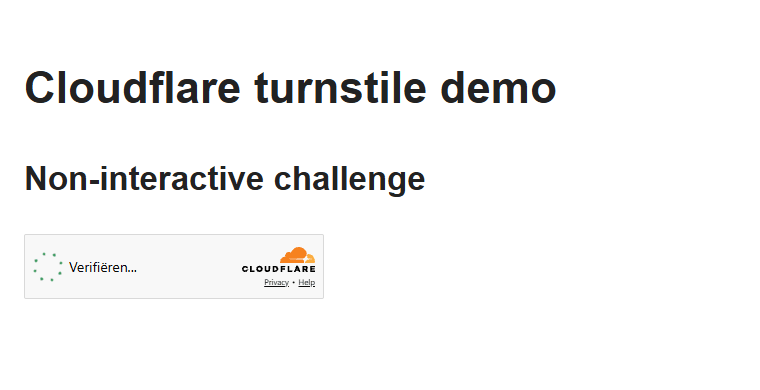

# Proxya Anty

<p align="center">
  
</p>

<p align="center">
  <strong><a href="https://github.com/ProxyaAnty/Proxya-Anty/releases/latest">Download Proxya Anty</a></strong><br>
  Windows x64 · macOS Apple Silicon · Linux x64
</p>

**Free Antidetect browser for stable multi-account automation — source-patched
Chromium, 168 coherent device fingerprints, proxy-aware profiles, desktop app,
Node.js and Python SDKs, MCP server, and Docker.**

[](https://www.npmjs.com/package/proxya-anty)
[](https://www.npmjs.com/package/proxya-anty-mcp)
[](https://pypi.org/project/proxya-anty/)
[](https://hub.docker.com/r/proxya/anty)
[](LICENSE)

Proxya Anty applies the selected fingerprint inside Chromium rather than by
injecting page JavaScript. Profiles keep platform, client hints, graphics,
canvas, audio, fonts, screen, timezone, media and network signals coherent.
The desktop application owns profiles, proxies, cookies and the signed engine;
the packages in this repository control it through an authenticated loopback
API.

> The SDK and MCP source in this repository are open under MIT. The desktop
> launcher, fingerprint catalogue, Chromium patches and engine remain
> proprietary and are distributed only as signed-release binaries. See
> [BINARY-LICENSE.md](BINARY-LICENSE.md).

## Why Proxya Anty

- **Source-level Chromium fingerprinting** — no page-level spoofing bundle.
- **168 curated fingerprints** — 118 Windows, 31 macOS and 19 Linux profiles.
- **Persistent multi-account profiles** — isolated cookies, storage and proxy.
- **Proxy consistency** — timezone and network-facing settings follow the exit.
- **Extensions** — from a Web Store link, a `.crx`, a `.zip` or a folder, loaded
  per profile, with each profile carrying its own copy.
- **Measured exits** — a proxy reports the operating system and network path of
  the machine its packets leave from, not just its address and country.
- **The identity before you commit to it** — the editor shows the profile it is
  about to create, so a contradiction is visible while it is being made.
- **Automation-ready** — authenticated local API, Node.js, Python and 39 MCP
  tools for profiles and browser control.
- **Three engine platforms** — Windows x64, macOS Apple Silicon and Linux x64.
- **Integrity first** — Ed25519-signed engine manifest plus per-file SHA-256.

## Detection checks

The release engine is tested on public detection pages and with local
regression suites. Results describe this exact release, not a universal promise
about every future website. **Last tested: 5 September 2026 (Chromium 152).**

### Live detection services

| Detection service or signal | Proxya Anty 1.0.6 | Verification notes |
|---|---|---|
| [PixelScan](https://pixelscan.net/fingerprint-check) | **PASS** — consistent fingerprint; no automated behavior detected | Windows profile with matching proxy timezone |
| [BrowserScan](https://www.browserscan.net/) | **PASS** — bot detection: No | Authenticity score also depends on IP, DNS and timezone consistency |
| [SannySoft](https://bot.sannysoft.com/) | **PASS** — 55/55 checks clean | Windows and macOS; Linux exposes 54 applicable checks, all clean |
| [CreepJS](https://abrahamjuliot.github.io/creepjs/) | **PASS** — 0% headless, 0% stealth | Compared with stock Chrome on the same host |
| [Device & Browser Info](https://deviceandbrowserinfo.com/are_you_a_bot) | **PASS** — `isBot: false` | Runtime/CDP guard enabled |
| [Cloudflare Turnstile](https://peet.ws/turnstile-test/non-interactive.html) | **PASS** | No solver, token injection or iframe modification; see the recording below |
| [FingerprintJS OSS](https://fingerprintjs.github.io/fingerprintjs/) | Profile stability check | Visitor ID is checked for stability inside a profile and isolation between profiles |
| `navigator.webdriver` | **`false`** | Windows, macOS and Linux |
| reCAPTCHA v3 score | **0.9** | Human score |
| WebRTC | **No local-address leak** | Candidate gathering is disabled whenever a proxy is bound |

### Release regression suites

| Check | Result |
|---|---:|
| Native fingerprint acceptance | 43 / 43 |
| Leak regression suite | 11 / 11 |
| Local HTTP API | 42 / 42 |
| MCP contract | 11 / 11 |
| Node.js SDK | 19 / 19 |
| Python SDK | 20 / 20 |
| Rust launcher tests | 150 / 150 |

### Cloudflare Turnstile test

The animation below records Proxya Anty opening the public non-interactive
Turnstile test page. No solver, token injection, iframe modification or
challenge-clicking code is used; Cloudflare makes the result itself.



## Install the desktop application

Download the latest build from [GitHub Releases](https://github.com/ProxyaAnty/Proxya-Anty/releases/latest). Product details
are available at [proxya.co/anty](https://proxya.co/anty).

| Platform | Build | Notes |
|---|---|---|
| Windows x64 | installer, MSI or portable ZIP | Windows 10/11 |
| macOS arm64 | DMG or portable ZIP | Apple Silicon (M1 and newer) |
| Linux x64 | AppImage, DEB or RPM | x86-64 desktop |

The current macOS build is ad-hoc signed. Follow the one-time
[macOS installation guide](docs/mac-installation.md) if Gatekeeper blocks it
([инструкция на русском](docs/mac-установка.md)).

## Tokens and licence

These values are separate and are never interchangeable:

| Value | Used for | Where it comes from |
|---|---|---|
| `PROXYA_ANTY_API_TOKEN` (SDK) / `PROXYA_ANTY_TOKEN` (MCP) | Authenticates the local desktop API on `127.0.0.1` | Generated by the desktop app; copy it from **Settings → Local API**. It is not a proxya.co account token or password. |
| `PROXYA_ANTY_LICENCE` | Authorizes the engine in Docker/direct-runtime use | Your Proxya account on proxya.co under **Settings → Proxya Anty**. |

## Node.js SDK

```bash
npm install proxya-anty
```

With the desktop app running, copy its local token from **Settings → Local
API**, then:

```bash
export PROXYA_ANTY_API_TOKEN="..."
```

```js
import { ProxyaAnty } from "proxya-anty";

const anty = new ProxyaAnty();
const profile = await anty.createProfile({ platform: "windows" });
const session = await anty.start(profile.id, { headless: true });
console.log(session.cdp.web_socket_debugger_url);
await anty.stop(profile.id);
```

## Python SDK

```bash
pip install proxya-anty
```

```python
from proxya_anty import ProxyaAnty

anty = ProxyaAnty()
profile = anty.create_profile(platform="macos")
session = anty.start(profile["id"], headless=True)
print(session["cdp"]["web_socket_debugger_url"])
anty.stop(profile["id"])
```

## MCP server

```bash
npx -y proxya-anty-mcp
```

Example client configuration:

```json
{
  "mcpServers": {
    "proxya-anty": {
      "command": "npx",
      "args": ["-y", "proxya-anty-mcp"],
      "env": {
        "PROXYA_ANTY_URL": "http://127.0.0.1:40427",
        "PROXYA_ANTY_TOKEN": "copy from Settings → Local API"
      }
    }
  }
}
```

## Docker

```bash
docker pull proxya/anty:latest
docker run --rm -e PROXYA_ANTY_LICENCE proxya/anty:latest selftest
```

The image includes the Linux engine and both SDK runtimes. A Proxya account
licence is supplied at runtime; never bake it into an image or compose file.

## Security and integrity

- The local API binds to loopback and requires a bearer token.
- Account and local application state are encrypted at rest by the desktop app.
- Engine archives are accepted only after signature, version, platform,
  complete executable-file manifest and SHA-256 verification.
- Release signing private keys, OAuth server credentials and proprietary source
  are not present in this repository or published packages.
- Report security issues privately as described in [SECURITY.md](SECURITY.md).

## Releases and feedback

Each release lists platform files, SHA-256 checksums, installation notes and
known limitations. Please report reproducible regressions with the affected
site, platform, profile OS and whether a proxy was used. Never include proxy
credentials, cookies, API tokens or account data in an issue.

Website: [proxya.co/anty](https://proxya.co/anty) · Support:
[proxya.co/contact](https://proxya.co/contact)
